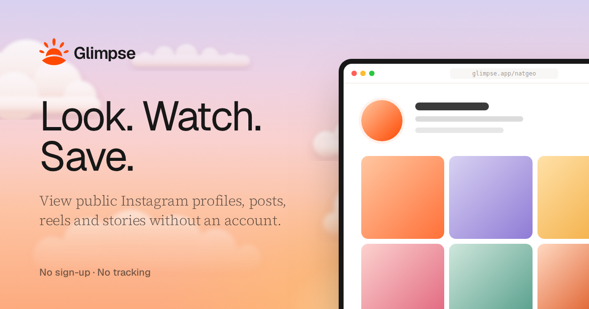

# Glimpse

<p></p>

Glimpse is a Next.js app for viewing public Instagram profiles, posts, reels, stories and highlights without an Instagram account. Paste a username or a post link, and Glimpse reads the public data from Instagram’s logged‑out API and renders a page you can browse and download from. Glimpse stores nothing you view.

Glimpse isn’t affiliated with Instagram or Meta, and it depends on unofficial endpoints that Instagram can change without notice. Automated access is against Instagram’s terms, so treat Glimpse as a personal or experimental project.

## Run Glimpse locally

Glimpse needs Node.js 20.9 or newer and pnpm 12. Clone the repository, install dependencies and start the dev server:

```console
$ git clone git@github.com:PunGrumpy/glimpse.git
$ cd glimpse
$ pnpm install
$ pnpm dev
```

Open [localhost:3000](http://localhost:3000) and search for a username such as `@nasa`, or paste an instagram.com post or reel link. With no configuration, Glimpse shows public profiles, posts, reels and highlight covers.

## Open a profile, post or reel by URL

Every Instagram page you can view has a Glimpse page at the same path, so you can swap the domain in any link:

| Instagram                        | Glimpse             |
| -------------------------------- | ------------------- |
| `instagram.com/nasa`             | `/nasa`             |
| `instagram.com/p/DW1nTDiDvnF`    | `/p/DW1nTDiDvnF`    |
| `instagram.com/reel/DdhFkS7KGkZ` | `/reel/DdhFkS7KGkZ` |

Profiles load 12 more posts each time you scroll to the end of the grid, and every photo and video has a download button.

## Enable stories and highlights

Instagram only serves story contents to logged‑in accounts, so Glimpse needs one to open stories and highlights. Set a service account once on the server, and every visitor can watch them without entering anything:

```dotenv
IG_SESSION_ID=your_instagram_sessionid
```

To find the value, log in to instagram.com in a browser, open DevTools, and copy the `sessionid` cookie from **Application** → **Cookies**. Use a secondary account, because Instagram can restrict accounts it detects automating requests. Glimpse uses the service account only for data any logged‑in account can see, and never to show private accounts.

## Let visitors see private accounts they follow

Private accounts unlock per visitor, not through the service account. A visitor pastes their own `sessionid` on the **Private accounts** page (`/accounts/session`), and Glimpse then shows exactly what that account is allowed to see, including private accounts it follows.

The session stays in an httpOnly cookie in the visitor’s browser for 30 days, where page scripts can’t read it. Glimpse sends it to Instagram only for that visitor’s requests, and never caches, logs or shares it with other visitors.

## Configure environment variables

Glimpse reads its configuration from `.env.local`. Copy the example file to start:

```console
$ cp .env.example .env.local
```

| Variable | Default | Purpose |
| --- | --- | --- |
| `IG_PROVIDER` | `web` | `web` reads Instagram; `mock` serves fake data for UI work |
| `IG_SESSION_ID` | none | Service account `sessionid` that enables stories and highlights for every visitor |
| `NEXT_PUBLIC_SITE_URL` | `http://localhost:3000` | Public URL of your deployment, used for absolute Open Graph image links |

## Work on the UI without Instagram

The mock provider returns fake profiles, posts and stories that stay the same between reloads, so you can build the interface without spending Instagram’s rate limit:

```dotenv
IG_PROVIDER=mock
```

Two usernames trigger error states: `/notfound` renders the not‑found page, and `/private` renders a private account.

## Deploy to Cloudflare Workers

Glimpse deploys to Cloudflare Workers through [OpenNext](https://opennext.js.org/cloudflare), which turns the `next build` output into a Worker. Run the app in the Workers runtime on your machine first, then deploy:

```console
$ pnpm run preview
$ pnpm run deploy
```

For deploys from Git with Workers Builds, set the build command to `pnpm exec opennextjs-cloudflare build` and the deploy command to `pnpm exec wrangler deploy`. Add `NEXT_PUBLIC_SITE_URL`, and `IG_SESSION_ID` if you want stories, as variables on the Worker. Image optimization runs through Cloudflare Images, so enable Images on the account.

Because profiles load through GraphQL on Workers, the reels tab only includes reels from the latest 12 posts, the link in a bio doesn’t show, and accounts hidden from logged‑out visitors show as not found. Instagram may also throttle Cloudflare’s IP addresses harder than a home connection.

## How Glimpse reads Instagram

On Node.js, Glimpse requests Instagram’s mobile API host (`i.instagram.com`) over HTTP/2, because its profile endpoint answers HTTP/1.1 clients with a 429 rate‑limit error and Next.js `fetch` speaks HTTP/1.1. When that endpoint throttles a server, Glimpse switches to Instagram’s logged‑out GraphQL queries for 5 minutes instead of retrying. On Cloudflare Workers, which can’t open HTTP/2 connections, profiles always load through GraphQL. Glimpse validates every response with [zod](https://zod.dev) before the app uses it.

Successful lookups stay in an in‑memory cache for 10 minutes, and stories for 1 minute. Anything fetched with a visitor’s own session skips that cache. Images load through the Next.js image optimizer and videos through `/api/media`, because Instagram’s content delivery network (CDN) blocks media embedded by other sites.

### Update Instagram query IDs when they change

Instagram changes its GraphQL query IDs without notice, and when it does, profiles or posts fail with a “Couldn’t reach Instagram” error. The current IDs are constants at the top of `lib/instagram/providers/web.ts`. The profile queries appear in the page Instagram serves to Googlebot, so fetch one and read the `queryID` values:

```console
$ curl -s -A "Mozilla/5.0 (compatible; Googlebot/2.1)" \
    https://www.instagram.com/nasa/ | grep -o '"queryID":"[0-9]*"'
```

The post and pagination queries live in Instagram’s JavaScript bundles instead. Search those bundles for `PolarisLoggedOutDesktopWWWPostRootContentQuery` and `PolarisProfilePostsLoggedOutTabFeedUIContentPaginationQuery`.

## Work on the Glimpse codebase

Glimpse uses Next.js 16 with the App Router, [coss ui](https://coss.com/ui) components, and [Ultracite](https://www.ultracite.ai) (Oxlint and Oxfmt) for linting and formatting. These scripts cover the daily loop:

```console
$ pnpm dev
$ pnpm check
$ pnpm fix
$ pnpm build
```

`pnpm check` reports lint and formatting issues, `pnpm fix` applies the automatic fixes, and a husky pre‑commit hook runs `ultracite fix` on staged files. The coss ui CLI generates `components/ui` and `hooks`, so linting skips them and regenerating a component keeps a clean diff. Read `AGENTS.md` for the code standards.

The code is organized by concern:

- `app/`: routes, including `[username]`, `p/[shortcode]`, `reel/[shortcode]`, `accounts/session`, and the API routes under `api/`
- `components/`: page sections and UI, including the story viewer and the hero sky
- `lib/instagram/`: the data layer, with the `web` and `mock` providers, zod schemas, session handling and caching
- `lib/brand.ts`: logo geometry shared by the header logo and the SVG and PNG exports
